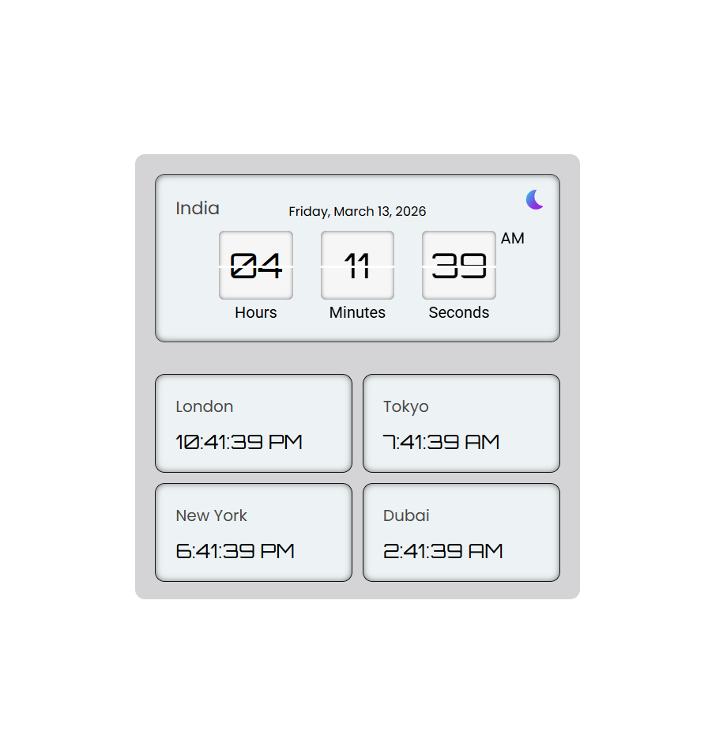
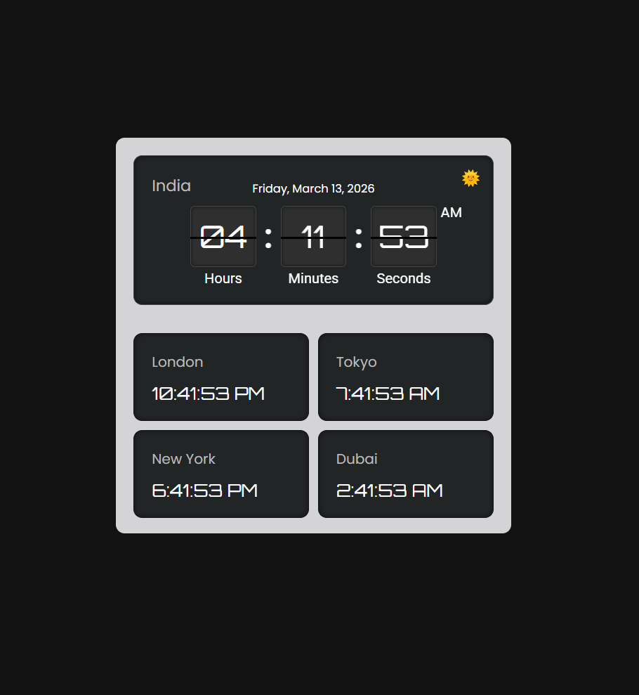

# Digital Clock Web App


A modern **Digital Clock Web Application** built using **HTML, CSS, and JavaScript**.

This application displays the **current time in real-time**, includes **date and weekday**, supports **Dark / Light theme switching**, and provides a **World Clock module** for multiple international cities.

The UI is designed with a **dashboard-style layout**, digital typography, animated separators, and responsive card-based components.

---

# Preview

<p align="center">


</p>

---

# Features

* Real-time Digital Clock
* 12-Hour Time Format with AM / PM
* Current Date and Weekday Display
* Dark Mode / Light Mode Toggle
* World Clock for Multiple Cities
* Responsive UI Layout
* Clean Dashboard-Style Design

---

# World Clock

The application shows the current time for different cities using JavaScript timezone support.

| City          | Time Zone        |
| ------------- | ---------------- |
| 🇮🇳 India    | Asia/Kolkata     |
| 🇬🇧 London   | Europe/London    |
| 🇯🇵 Tokyo    | Asia/Tokyo       |
| 🇺🇸 New York | America/New_York |

Implemented using:

```javascript
toLocaleTimeString("en-US", { timeZone: "Asia/Kolkata" })
```

---

# Technologies Used

| Technology       | Purpose                      |
| ---------------- | ---------------------------- |
| HTML5            | Structure of the application |
| CSS3             | Layout, styling, animations  |
| JavaScript (ES6) | Time logic and DOM updates   |

---

# Project Structure

```
digital-clock
│
├── index.html
├── style.css
├── script.js
├── assets
│   ├── moon.svg
│   └── sun.svg
└── preview.png
```

---

# How It Works

### Real-Time Clock

The clock updates every second using:

```javascript
setInterval(updateClock, 1000);
```

### Time Formatting

JavaScript converts the system's **24-hour time** to **12-hour format with AM/PM**.

### World Clock

Different international times are generated using the **built-in JavaScript timezone API**.

---

### Run Locally

Follow these steps to run the project on your local machine.

### 1. Clone the repository

```bash
git clone https://github.com/yourusername/digital-clock.git
```

### 2. Navigate into the project directory

```bash
cd digital-clock
```

### 3. Open the project

Simply open the `index.html` file in your browser.

You can also use **VS Code Live Server** for a better development experience.

---


# Contributing

Contributions are welcome.

If you'd like to improve the project:

1. Fork the repository
2. Create a new branch
3. Commit your changes
4. Submit a Pull Request

---

# Future Improvements

Possible upgrades:

* Alarm functionality
* Countdown timer
* Stopwatch
* More world clock locations
* Flip clock animation
* Fullscreen clock mode

---

# Learning Outcomes

This project demonstrates:

* JavaScript **Date API**
* **Time formatting and timezones**
* DOM manipulation
* Responsive UI design
* Theme switching using CSS

---

# Support

If you found this project helpful, consider giving it a **star ⭐ on GitHub**.

---

# License

This project is licensed under the **MIT License**.
